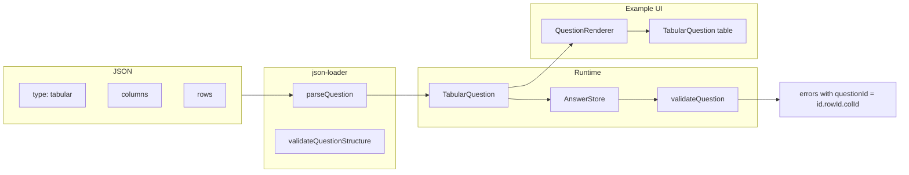

# Tabular question type

## Data model

**Types** ([src/types/questions.ts](src/types/questions.ts))

- Extend `QuestionType`: add `'tabular'`.
- Define **column config**: each column has `id`, `label`, and a **cell spec** that reuses existing question shapes (e.g. `type: 'text' | 'number' | ...` plus type-specific fields like `options`, `min`, `max`). Use a discriminated union or a single type with optional fields so the loader can parse one of the existing question schemas per column.
- Define **row config**: `{ id: string; label?: string }` (label optional for header row).
- Define `TabularQuestion` extending `BaseQuestion`:
  - `type: 'tabular'`
  - `columns: TabularColumn[]` (each with `id`, `label`, and cell question config)
  - `rows: TabularRow[]`
- Export new types from [src/types/index.ts](src/types/index.ts).

**Answers** ([src/types/answers.ts](src/types/answers.ts))

- Extend `AnswerValue` with a tabular shape: `Record<string, Record<string, AnswerValue>>` (rowId -> columnId -> cell value). Use a type guard or branded type so existing code still treats `AnswerValue` as the current union.
- Submit/APIs: one answer entry per tabular question with this object as `value`. Optional cells: missing or empty cell values are allowed when the column does not require a value (no `required` / no `required` rule in the column’s validation).

## JSON schema and loader

**JSON shape** (document in [docs/json-guide.md](docs/json-guide.md))

- `type: "tabular"`
- `columns`: array of `{ id, label, ... }` where `...` is the same as one of the existing question types (e.g. `type: "number", min, max` for a number column). No top-level `id`/`label` on the column object beyond column `id`/`label`; the rest is the “cell question” config.
- `rows`: array of `{ id, label? }`.

**Loader** ([src/utils/json-loader.ts](src/utils/json-loader.ts))

- Add `'tabular'` to `isValidQuestionType`.
- In `validateQuestionStructure`, for `type === 'tabular'`: require `columns` (non-empty array) and `rows` (non-empty array); validate each column has `id`, `label`, and a valid cell type; validate each row has `id`.
- Add a tabular question parser: parse columns (each column’s cell config via the same helpers used for existing question types, or a small per-type parser that returns a “cell spec” object), parse rows, return `TabularQuestion`.
- Register the tabular parser in the question parser registry.

## Question registry and validation

**Registry** ([src/questions/registry.ts](src/questions/registry.ts), [src/questions/index.ts](src/questions/index.ts))

- Register a factory for `'tabular'` that returns a `BaseQuestion` implementation.

**Tabular question module** (new, e.g. `src/questions/tabularQuestion.ts`)

- `createTabularQuestion(data: TabularQuestion): BaseQuestion`:
  - `validate(value)`: if value is not a rowId->columnId->cell map, return invalid. For each row/column, get cell value and validate it with the column’s type and rules (reuse existing validators). If the column (or cell spec) has no `required` rule, treat empty/missing as valid for that cell. Aggregate errors with a clear key (e.g. `questionId` plus row/column so UI can show per-cell errors).
  - `getDefaultValue()`: return `{}` or a nested object with no cells filled (empty table).
  - `serialize()`: return the `TabularQuestion` object.

## Engine and state

- **Engine** ([src/engine/QuestionnaireEngine.ts](src/engine/QuestionnaireEngine.ts)): `setAnswer(questionId, value)` and `getAnswer(questionId)` already accept/return `AnswerValue`; once `AnswerValue` includes the tabular object, no change except `questionExists` already matches the single tabular question id.
- **State / submit**: Submit loop in `QuestionnaireEngine.submit()` already iterates `section.questions` and pushes one `{ questionId, value }` per question; the tabular question will push one entry with the composite object as `value`. No change needed if `RawAnswer.value` allows that shape (extend type if necessary).
- **Formulas / scoring**: Document that formulas and scoring config reference question ids; a tabular question is one id and its value is the full table object. No formula syntax for “cell path” in this phase (optional future work).

## Example UI (medical-questionnaire)

- **QuestionRenderer** ([examples/medical-questionnaire/src/components/QuestionRenderer.tsx](examples/medical-questionnaire/src/components/QuestionRenderer.tsx)): add `case 'tabular'` and render a new `TabularQuestion` component.
- **TabularQuestion component** (new): render a `<table>` with header row from `columns` and one data row per `rows`. Each cell renders the appropriate input for the column’s type (reuse existing TextQuestion, NumberQuestion, etc. as small inline inputs, or a minimal cell renderer per type). Value prop is the composite object; onChange merges the updated cell into the object and calls `onChange(newValue)`. Show per-cell validation errors if the engine returns errors keyed by questionId + row/column (or a convention like `questionId.rowId.columnId` in `ValidationError.questionId`).

## Validation errors for cells

- In `tabularQuestion.validate()`, when a cell fails, push an error with a consistent `questionId` so the UI can map it back. Options: (1) use a synthetic id like `${question.id}.${rowId}.${colId}` in validation errors, or (2) keep `questionId` as the tabular id and add an optional `path` or `cell: { rowId, colId }` in `ValidationError`. Option 1 is minimal change (only extend `ValidationError` if the type doesn’t allow extra fields). Prefer option 1: use `questionId:` ${tabularId}.${rowId}.${colId}`` so existing `ValidationError` shape stays and the UI can parse or match by prefix.

## Files to add

- `src/questions/tabularQuestion.ts` – tabular question factory and validation logic.

## Files to touch (summary)

- [src/types/questions.ts](src/types/questions.ts) – `QuestionType`, `TabularColumn`, `TabularRow`, `TabularQuestion`, `Question` union.
- [src/types/answers.ts](src/types/answers.ts) – extend `AnswerValue` for tabular; ensure submit/raw-answer types allow it.
- [src/types/index.ts](src/types/index.ts) – export new types.
- [src/utils/json-loader.ts](src/utils/json-loader.ts) – validation and parser for tabular; register parser.
- [src/questions/registry.ts](src/questions/registry.ts) – register tabular (if registration is per-type in this file; otherwise only in questions/index).
- [src/questions/index.ts](src/questions/index.ts) – register and export tabular factory.
- [src/validation/engine.ts](src/validation/engine.ts) – no change if `validateQuestion(question, value)` is called with the composite value for tabular; validators may need to ignore non-applicable types when value is object (or add a tabular-specific branch in `validateQuestion` that delegates to the question’s own `validate`).
- [src/validation/registry.ts](src/validation/registry.ts) or validators – ensure required/min/max etc. are only applied when the value is the expected type; tabular will call them per cell with scalar values.
- [docs/json-guide.md](docs/json-guide.md) – document tabular JSON format and optional cells.
- Example app: [QuestionRenderer](examples/medical-questionnaire/src/components/QuestionRenderer.tsx) + new `TabularQuestion.tsx` component.

## Validation flow for tabular

- `validateAll(questions, answers)` gets `value = answers[question.id]` for the tabular question (the composite object). It calls `validateQuestion(question, value)`. Today `validateQuestion` uses `validateValue(value, rules, question.id, question)` with the question’s validation rules. For tabular we need **custom logic**: run per-cell validation using each column’s type and rules. So either:
  - **A)** In `validateQuestion` (validation/engine.ts), if `question.type === 'tabular'`, call `question.validate(value)` (the BaseQuestion method) and return that result; or
  - **B)** Register tabular in the question registry so that `createQuestion(tabularQuestion)` returns a BaseQuestion whose `validate(value)` does the per-cell logic, and ensure the state manager / validation engine calls that. Currently the validation engine uses `validateQuestion(question, value)` which uses the validation rule registry, not the question’s validate method. So we need to hook the question’s own `validate` for tabular.

Checking: [validation/engine.ts](src/validation/engine.ts) uses `validateValue(value, rules, question.id, question)` and doesn’t call `question.validate`. So the **question registry** returns a `BaseQuestion` with a `validate` method, but that’s used elsewhere (e.g. when creating the question). So we have two paths: (1) validation engine calls `validateQuestion` which only uses rules; (2) question’s `validate` exists on BaseQuestion but isn’t used by validateAll. So we need to change the validation engine to use the question’s validate when available (e.g. for tabular), or have a special case for tabular in validateQuestion that runs per-cell validation. Cleanest: in `validateQuestion`, if the question has a `.validate` method that is the “real” validation (e.g. for tabular), use it; otherwise use the current rules-based validateValue. But the current questions are created by the registry and have a `.validate` method on the BaseQuestion. So the state manager holds Questionnaire (with serialized questions) and a questionRegistry of BaseQuestion. When we call validateAll(questions, answers), we pass the serialized `Question[]` from the questionnaire, not the BaseQuestion instances. So we don’t have the `.validate` method in the validation engine unless we get the BaseQuestion from somewhere. So we need either: (1) validation engine to receive or resolve BaseQuestion so it can call baseQuestion.validate(value), or (2) in validateQuestion, branch on question.type === 'tabular' and run custom tabular validation (duplicating the logic that would live in tabularQuestion.validate). Option 2 is simpler and keeps validation engine only using the serialized question: add a branch in validateQuestion for type 'tabular' that implements the per-cell validation (or calls a dedicated validateTabularQuestion(question, value) helper that lives in the tabular module). So: implement validate in the tabular module as a standalone function validateTabularQuestion(question, value) that returns ValidationResult with synthetic questionIds for cells, and in validation/engine.ts validateQuestion, if question.type === 'tabular', call that and return; otherwise use validateValue as today.

## Diagram

